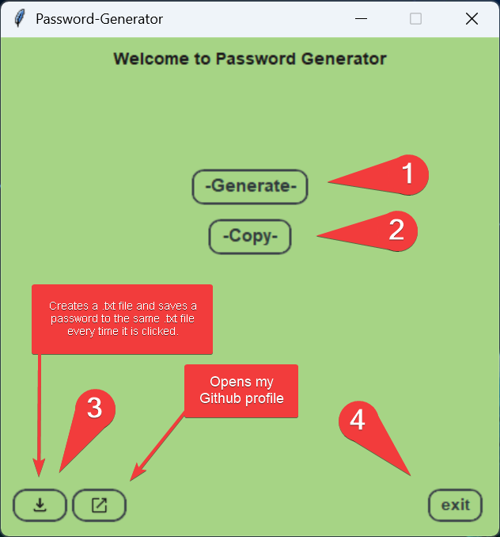

# Tkinter-Password-Generator🔐



## 🗒️Instructions
1. **Generate:** Click the button to generate a random secure password
2. **Copy:** Copy the generated password to your clipboard
3. **Save:** Save the password to a `.txt` file. Each new password is appended to the same file
4. **Exit:** Securely close the application

## 📄 File Details
- **Format:** Plain text `.txt`
- **Encoding:** UTF-8
- **Location:** Desktop

## ⚠️ Security Warning
- **Confidentiality:** This `.txt` file contains sensitive information. Do not share this `.txt` file with anyone.
- **Protection:** It is recommended to move these passwords to a dedicated password manager or encrypt this file if you are on a shared computer.

## 🔒 Technical Details & Security

This project is built with a focus on security, using modern Python standards.

*   **Cryptographically Strong:** Instead of the standard `random` module, this app uses the **`secrets`** module. It is specifically designed to generate cryptographically strong random numbers suitable for managing secrets such as passwords and account authentication.
*   **High Entropy:** By using `secrets`, the application leverages the most secure sources of randomness provided by your operating system (e.g., `/dev/urandom` on Linux/macOS or `CryptGenRandom` on Windows).
*   **Safe Handling:** The app includes built-in security warnings to remind users that generated passwords should never be stored in unencrypted `.txt` files.

## 🛠️ Installation & Setup

To run this project, you need to have **Python 3.x** installed.

1. **Clone the repository:**
   ```bash
   git clone https://github.com/niwobyte/Tkinter-Password-Generator.git
   cd Tkinter-Password-Generator
   pip install -r requirements.txt
   python Passwort-GNR.py

> [!IMPORTANT]
> Always use a dedicated password manager (like Bitwarden or KeePassXC) to store your passwords securely.

---
*Generated by [niwobyte](https://github.com/niwobyte)*
